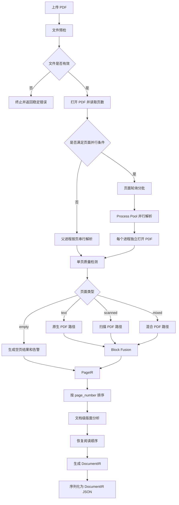
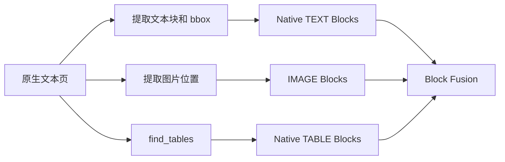
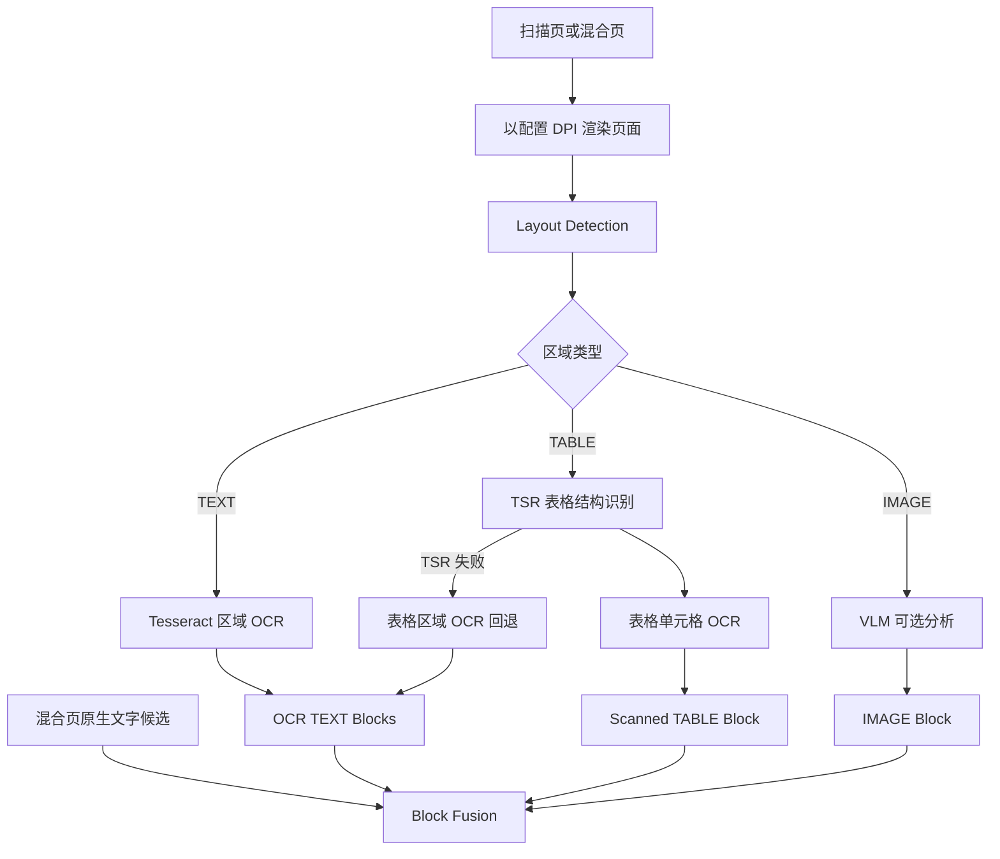
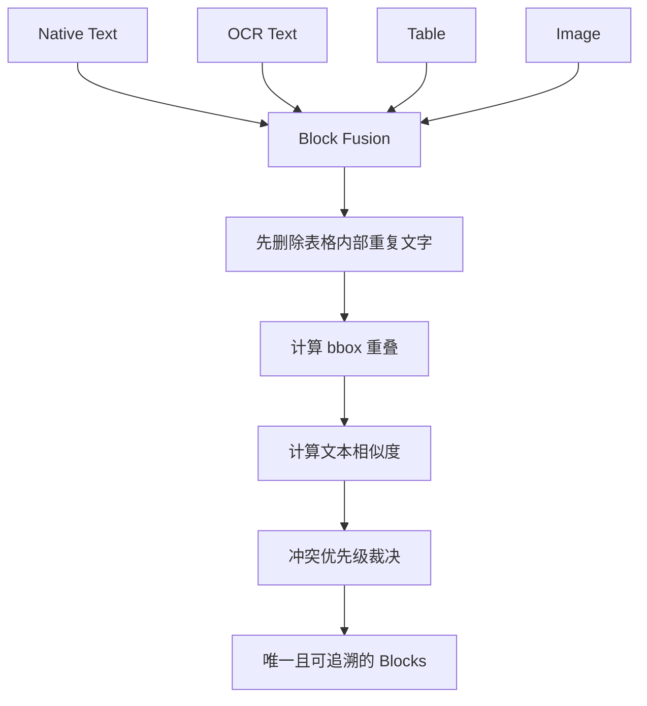
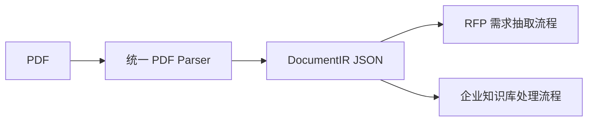

# DealFlow PDF 处理流程

本文介绍 DealFlow 中统一 PDF 处理模块的完整工作流程。该模块同时服务于 RFP 文件和企业知识库文件，负责把来源不同、版式不同的 PDF 转换为统一的 `DocumentIR`。生成 `DocumentIR` 后，RFP 和知识库才分别进入需求抽取、能力判断、知识切分和向量化等下游流程。

本文只描述 PDF 解析，不包含后续业务逻辑。

## 1. 处理目标

PDF 文件可能包含以下内容：

- 带文本层的原生 PDF；
- 只有页面图片的扫描 PDF；
- 原生文字、扫描图片和表格并存的混合 PDF；
- 单栏、双栏、页眉、页脚、标题、列表和题注等版面结构；
- 原生表格、扫描表格以及普通图片。

统一处理模块需要解决三个问题：

1. 根据每一页的实际内容选择正确的处理路径；
2. 合并 PyMuPDF、OCR、表格识别和图片分析产生的结果；
3. 输出结构稳定、顺序正确且可以追踪来源的中间格式。

## 2. 总体流程

PDF 按“页”路由，而不是先给整份文档指定一种解析方式。同一份 PDF 中，第 1 页可以走原生文本路径，第 2 页可以走扫描页路径，第 3 页可以走混合页路径。



核心入口位于：

- `app/documents/parser.py`：根据扩展名选择 PDF 或 DOCX 解析器；
- `app/documents/pdf/native.py`：PDF 预检、页面并行、逐页路由和 DocumentIR 构建；
- `app/documents/pdf/models.py`：`BlockIR`、`PageIR` 和 `DocumentIR` 数据模型。

## 3. 文件预检

PDF 进入逐页处理前，首先执行文件预检。预检用于尽早拒绝无法安全处理的文件，避免在 OCR 或版面分析阶段才失败。

当前检查内容包括：

- 文件是否为空；
- 文件是否可以被 PyMuPDF 打开；
- 是否是有效 PDF；
- 是否加密或需要密码；
- 是否至少包含一页；
- 页数是否超过配置上限；
- 文件大小、PDF 元数据和页数是否可以正常读取。

预检失败会抛出稳定的错误码，调用方可以区分文件损坏、加密、空文档或页数超限等情况。

## 4. 页面级并行

通过预检后，解析器根据配置决定串行或并行提取页面。

默认配置：

```env
PDF_PAGE_PARALLEL_ENABLED=true
PDF_PAGE_WORKERS=4
PDF_PAGE_PARALLEL_MIN_PAGES=4
```

当 PDF 页数达到阈值、进程数大于 1，并且 OCR、Layout、TSR 和 Vision Provider 与多进程兼容时，解析器使用共享进程池。

```text
10 页 PDF，4 个进程

进程 1：1, 5, 9
进程 2：2, 6, 10
进程 3：3, 7
进程 4：4, 8
```

页面采用轮询方式分批，使复杂页尽量分散到不同进程。每个进程独立打开 PDF，不跨进程传递 PyMuPDF 的 `Document` 或 `Page` 对象。

页面可以乱序完成，但父进程会：

1. 收集各进程返回的 `PageIR`；
2. 按 `page_number` 升序排序；
3. 检查页码是否从 1 到总页数连续完整；
4. 再执行依赖全局页面信息的版面分析。

如果进程池创建、子进程执行或结果校验失败，解析器会记录回退原因，并重新使用串行方式解析整份 PDF。

## 5. 单页质量检测与分类

每一页首先通过 PyMuPDF读取原生文本块和图片信息，然后计算：

- 有效字符数；
- 单词数；
- 乱码字符数和乱码率；
- 原生文字 bbox 的页面覆盖率；
- 图片 bbox 的页面覆盖率；
- 是否需要 OCR；
- 页面分类置信度。

最终将页面分为四类：

| 页面类型 | 典型特征 | 处理路径 |
| --- | --- | --- |
| `text` | 原生文字充足，图片占比较低 | 原生文本路径 |
| `scanned` | 原生文字不足，页面主要由图片构成 | 扫描页多模态路径 |
| `mixed` | 原生文字与较大图片区域同时存在 | 保留原生文字并执行多模态路径 |
| `empty` | 没有可用文字或有效图片内容 | 空 PageIR 和告警 |

文档类型不会反过来决定页面路由。只有所有页面处理完成后，系统才根据全部 `page_type` 汇总出文档级类型。

## 6. 原生文本页路径

原生文本页主要依赖 PyMuPDF：



### 6.1 原生文字

PyMuPDF 提供文字内容、字体、字号、粗体信息和 bbox。系统将这些信息保存到候选 Block 中，为后续标题识别、段落合并和阅读顺序判断提供依据。

### 6.2 原生表格

对于带文本层和线条结构的表格，系统使用 PyMuPDF `find_tables` 提取表格，将单元格转换为 Markdown：

```markdown
| 指标 | 要求 |
| --- | --- |
| 可用性 | 99.9% |
```

表格区域内重复出现的普通文本会在 Block Fusion 阶段删除，避免同一内容同时以普通文字和表格输出。

### 6.3 原生图片

系统提取图片在页面上的 bbox，并生成 `IMAGE Block`。如果未启用 VLM，图片 Block 只保存位置、来源和相关元数据，不生成图片语义描述。

## 7. 扫描页和混合页路径

扫描页和混合页先进行页面渲染和 Layout Detection，再根据区域类型选择处理器。



### 7.1 Layout Detection

当前实现使用 OpenCV 启发式检测器，把页面划分为：

- `TEXT`：普通文字区域；
- `TABLE`：疑似表格区域；
- `IMAGE`：普通图片、架构图或其他视觉区域。

如果没有检测到可靠区域，系统会回退为一个覆盖整页的文本区域，然后尝试整页 OCR。

### 7.2 OCR

当前 OCR Provider 是 Tesseract。处理步骤如下：

1. 使用 PyMuPDF 把页面区域按配置 DPI 渲染为 PNG；
2. 调用 Tesseract CLI 输出 TSV；
3. 从 TSV 读取文字、行号、bbox 和置信度；
4. 将像素坐标映射回 PDF 页面坐标；
5. 生成带位置和置信度的 OCR TEXT Blocks。

需要注意，OCR 是一种识别技术，Tesseract 是当前项目采用的 OCR 引擎。项目通过 `OCRProvider` 抽象隔离具体实现，未来可以替换为 PaddleOCR、RapidOCR 或云端 OCR。

### 7.3 扫描表格

扫描表格不使用 `find_tables`，而是采用：

```text
Layout Detection
→ 裁剪表格区域
→ OpenCV 检测横线和竖线
→ 恢复行列结构
→ 对单元格执行 OCR
→ 生成 TABLE Block 和 Markdown
```

如果无法恢复有效网格、单元格数量超过限制，或者单元格 OCR 失败，则记录 `TSR_FAILED`，并回退为表格区域普通 OCR。

### 7.4 图片区域

图片区域始终生成 `IMAGE Block`。如果启用 VLM，系统还会把区域图片发送给兼容的视觉模型，保存图片描述和可见文字；如果未启用 VLM，只保存图片位置和检测信息。

## 8. Block Fusion

混合页可能同时得到 Native Text、OCR Text、TABLE 和 IMAGE。如果直接拼接，正文和表格内容很容易重复，因此所有候选 Block 必须经过融合。



### 8.1 表格内容去重

如果文字 Block 有至少 50% 的自身面积位于表格 bbox 内，则认为内容已经由结构化表格表示，删除普通文字并保留 TABLE。

### 8.2 Native Text 与 OCR Text 去重

两个文字 Block 同时满足以下条件时视为重复：

- bbox IoU 至少为 0.55，或者较小 Block 至少有 80% 被另一个 Block 覆盖；
- 归一化后的文本相似度至少为 0.88。

文本归一化会忽略大小写、空格和大部分标点。冲突时使用以下优先级：

```text
Native > OCR > Derived
高置信度 > 低置信度
内容完整 > 内容残缺
```

被丢弃的 Block ID 会保存到 `fusion_discarded_block_ids`，页面 metadata 同时记录去重数量和冲突处理数量。

### 8.3 图片去重

两个 IMAGE Block 的 bbox IoU 达到 0.55 时视为同一图片，保留评分更高的结果。图片不会与正文或表格合并。

## 9. 版面语义与阅读顺序

页面级提取完成并恢复页码顺序后，父进程执行文档级版面分析。

### 9.1 语义分类

系统根据文字内容、字体大小、粗体信息、页面位置以及跨页重复情况，将普通文本进一步分类为：

- `TITLE`；
- `TEXT`；
- `LIST`；
- `HEADER`；
- `FOOTER`；
- `CAPTION`；
- `FOOTNOTE`。

跨页反复出现在顶部或底部的短文本会被识别为页眉或页脚。单独的页码也可以被识别为页脚。

### 9.2 分栏检测

系统根据文本块中心点、栏间距和纵向重叠情况判断单栏或双栏。跨越两栏的大标题、表格和图片会标记为跨栏 Block。

### 9.3 段落合并

相邻文本只有在以下条件基本一致时才会合并：

- 位于同一栏；
- 垂直距离没有超过段落阈值；
- 左边缘对齐或水平方向明显重叠；
- 字号差异没有超过限制；
- 不会把两个独立列表项错误合并；
- 不会跨越明显的句子边界和大间距。

合并后的 Block 使用两个 bbox 的外包矩形，平均有效置信度，并把原始 Block ID 保存到 `layout_merged_from`。

### 9.4 标题合并和题注关联

层级、字号、栏位和水平中心相近的连续标题可以合并。题注不会与表格或图片合成一个 Block，而是通过 `caption_for_block_id` 指向最近的 TABLE 或 IMAGE。

### 9.5 阅读顺序

单栏页面通常按从上到下、从左到右排列。双栏页面优先排列左栏，再排列右栏，并在正确位置插入跨栏标题、图片和表格。页眉放在最前，页脚放在最后。

最后重新生成稳定的 Block ID 和 `reading_order`：

```text
p1_b0001
p1_b0002
p2_b0001
...
```

## 10. PageIR 和 DocumentIR

### 10.1 BlockIR

`BlockIR` 是最小内容单元，核心字段包括：

- `block_id`；
- `type`；
- `bbox`；
- `source`；
- `reading_order`；
- `text` 或 `table_markdown`；
- `confidence`；
- `metadata`。

### 10.2 PageIR

`PageIR` 表示单页结果，包含：

- 页码、页面宽高和页面类型；
- 排序后的 Blocks；
- 页面置信度；
- 页面级告警；
- Quality、Routing、OCR、Layout、TSR、VLM 和 Fusion metadata。

### 10.3 DocumentIR

`DocumentIR` 是统一 PDF 解析的最终结果，包含：

- 文档 ID、原始文件名和 SHA-256；
- 解析器版本；
- 文档类型和处理状态；
- 完整有序的 PageIR 列表；
- 文档级告警；
- 页面并行模式和回退信息；
- 纯文本摘要和校验信息。

文档类型根据页面类型汇总：

```text
全部是 text 页面       → text_based
全部是 scanned 页面    → scanned
包含多种有效页面类型   → mixed
```

如果存在警告级解析问题但仍产生了可用结果，状态为 `partial_success`；没有警告级问题时为 `succeeded`。

## 11. 统一输出及下游分流

开发测试接口会生成一个 ZIP：

```text
<filename>.pdf-parse-result.zip
├── <filename>.document-ir.json
├── <filename>.parsed.md
└── <filename>.summary.json
```

三个文件的用途：

| 文件 | 用途 |
| --- | --- |
| `document-ir.json` | 统一结构化结果，是后续 RFP 和知识库处理的主要输入 |
| `parsed.md` | 便于人工阅读和快速检查解析文本、表格与顺序 |
| `summary.json` | 快速查看页数、页面类型、路由、告警和并行执行情况 |

RFP 和企业知识库共享 PDF 解析链路，只在 DocumentIR 生成后分开：



## 12. 错误、告警和降级

系统尽量区分“无法继续”和“可以降级继续”：

| 情况 | 处理方式 |
| --- | --- |
| PDF 损坏、加密、空文档、页数超限 | 终止处理 |
| Layout Detection 失败 | 回退到整页 OCR |
| TSR 失败 | 回退到表格区域 OCR |
| OCR 不可用或失败 | 保留可用原生内容并记录告警 |
| VLM 失败 | 保留 IMAGE Block 和区域信息 |
| 页面并行失败 | 整份文档回退到串行解析 |

所有可以追踪的异常都会进入 PageIR 或 DocumentIR 的 `warnings`，并包含错误码、页码、Provider 和降级方式。

## 13. 当前性能特点

页面级并行只能并行不同页面，不能自动并行同一页内部的所有 OCR 操作。目前混合页中的文本区域、表格区域和表格单元格依次调用 Tesseract，因此复杂扫描页可能成为整个文档的最长任务。

当前执行方式：

```text
页面之间：Process Pool 并行
单页区域之间：串行
表格单元格之间：串行
```

直接无限并行区域 OCR 可能同时启动大量 Tesseract 进程，引发 CPU 争抢和内存压力。后续更合理的优化方向是整页只做一次带坐标 OCR，然后按照 bbox 把 OCR 结果分配给文本区域和表格单元格。

## 14. 本地测试

服务启动后，可以通过开发接口测试任意本地 PDF：

```powershell
curl.exe --fail-with-body -X POST "http://localhost:8000/dev/pdf/parse" `
  -F "file=@C:\path\to\document.pdf;type=application/pdf" `
  -o "document.pdf-parse-result.zip"
```

解压后建议首先查看 `summary.json`，确认：

- `page_count` 是否正确；
- `page_extraction.mode` 是否为预期的 `process_pool` 或 `sequential`；
- `page_routes` 是否符合每页内容；
- `warning_count` 和告警内容；
- 页面顺序是否完整。

然后查看 `parsed.md` 验证阅读顺序和文字内容，最后在需要调试 bbox、Block 来源或融合细节时检查 `document-ir.json`。

## 15. 代码模块索引

| 模块 | 代码位置 |
| --- | --- |
| 统一文档入口 | `app/documents/parser.py` |
| PDF 配置 | `app/documents/pdf/config.py` |
| 文件预检 | `app/documents/pdf/preflight.py` |
| 页面质量检测 | `app/documents/pdf/quality.py` |
| 页面路由和并行解析 | `app/documents/pdf/native.py` |
| OCR Provider | `app/documents/pdf/ocr.py` |
| Layout Detection | `app/documents/pdf/layout/detection.py` |
| 原生表格提取 | `app/documents/pdf/layout/tables.py` |
| 扫描表格 TSR | `app/documents/pdf/layout/tsr.py` |
| 图片 VLM | `app/documents/pdf/vision.py` |
| Block Fusion | `app/documents/pdf/fusion.py` |
| 语义、分栏和阅读顺序 | `app/documents/pdf/layout/analyzer.py` |
| IR 数据模型 | `app/documents/pdf/models.py` |
| DocumentIR 序列化 | `app/documents/pdf/serialization.py` |
| 本地测试接口 | `app/api/routes/pdf_test.py` |
| ZIP 测试产物 | `app/documents/pdf/bundle.py` |
