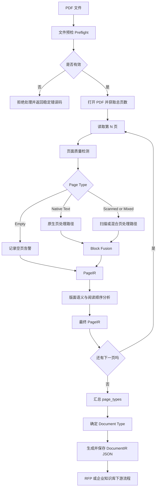
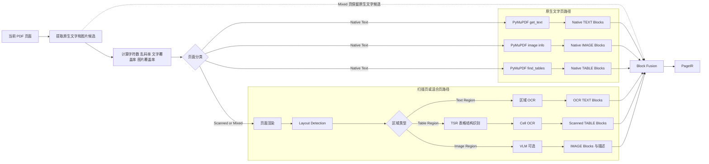
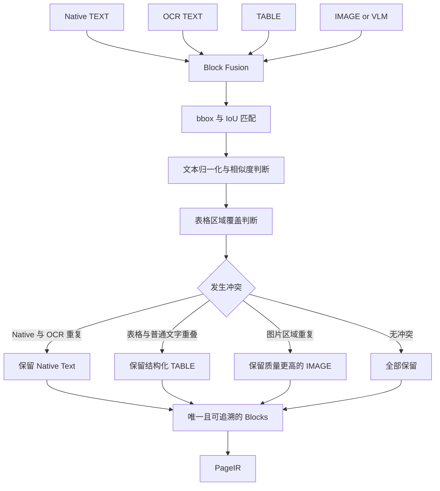
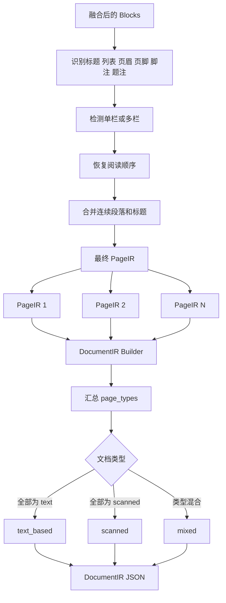

# PDF 技术处理架构示意图

本文只描述统一 PDF 解析模块。RFP 与企业知识库共用这条解析链路，输出统一的
`DocumentIR JSON`；需求抽取、知识库切分、向量化等下游逻辑不在本文范围内。

## 1. 总体流程



文件预检负责检查：

- 文件是否为有效 PDF；
- 是否加密；
- 是否包含页面；
- 页面数量是否超过限制；
- 文件元数据与校验和是否可读取。

## 2. 单页路由与多模态处理

路由粒度是“页”，不是“整份文档”。同一个 PDF 的不同页面可以进入不同路径。



页面类型及其处理方式：

| 页面类型 | 判断特征 | 处理路径 |
| --- | --- | --- |
| `text` | 原生文字充足，图片覆盖率较低 | PyMuPDF 原生提取 |
| `scanned` | 几乎没有可靠原生文字，页面主要由图像构成 | 页面渲染、版面检测、区域 OCR/TSR/VLM |
| `mixed` | 同时存在可靠原生文字和较大图片区域 | 保留原生候选，同时运行区域 OCR/TSR/VLM |
| `empty` | 没有有效文字，也没有实质图片内容 | 生成空 PageIR 并记录告警 |

## 3. Block Fusion

多个通道的结果不能直接拼接，必须先消除重复与冲突。



当前主要优先级：

```text
结构化 TABLE > 表格区域内的普通文字
Native Text > OCR Text
高置信度结果 > 低置信度结果
内容完整的结果 > 内容残缺的结果
```

被丢弃块的 ID、冲突数量和去重统计会保存在页面 metadata 中。

## 4. PageIR 后处理与 DocumentIR 汇总



统一输出保存以下核心信息：

- 文档 ID、文件名、SHA-256、解析器版本；
- 文档级类型与处理状态；
- 每一页的页面类型、实际路由、尺寸和置信度；
- 每个 Block 的类型、来源、bbox、阅读顺序、文字或表格 Markdown；
- OCR、Layout、TSR、VLM 与 Block Fusion 的处理 metadata；
- 可追溯的告警、降级路径和失败原因。

## 5. 模块对应关系

| 技术模块 | 当前代码位置 |
| --- | --- |
| 逐页分类与路由 | `app/documents/pdf/native.py`、`quality.py` |
| Layout Detection | `app/documents/pdf/layout/detection.py` |
| 区域 OCR | `app/documents/pdf/ocr.py` |
| TSR 与 Cell OCR | `app/documents/pdf/layout/tsr.py` |
| 图片区域 VLM | `app/documents/pdf/vision.py` |
| Block Fusion | `app/documents/pdf/fusion.py` |
| 版面语义与阅读顺序 | `app/documents/pdf/layout/analyzer.py` |
| DocumentIR 模型与序列化 | `app/documents/pdf/models.py`、`serialization.py` |

